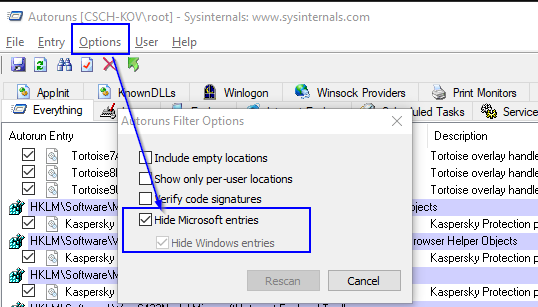

## Tool Source 
https://live.sysinternals.com/

## Sigcheck
```shell
C:\windows\> sigcheck -e -u -vr -s C:\
-e --> look at all executables
-u --> show only unsigned ones
-vr --> check the hash on VirusTotal.com
-s --> recursive
```

## Strings
```shell
C:\SysinternalsSuite>strings "C:\something\somebinary"
 
Strings v2.51
Copyright (C) 1999-2013 Mark Russinovich
Sysinternals - www.sysinternals.com
 
[ ... ]
MS16-014 EoP PoC created from
https://github.com/Rootkitsmm/cve-2016-0040/blob/master/poc.cc
Spawns CMD.exe with SYSTEM rights.
[ ... ]
```

## Autoruns
```shell
C:\SysinternalsSuite>autoruns.exe
```
